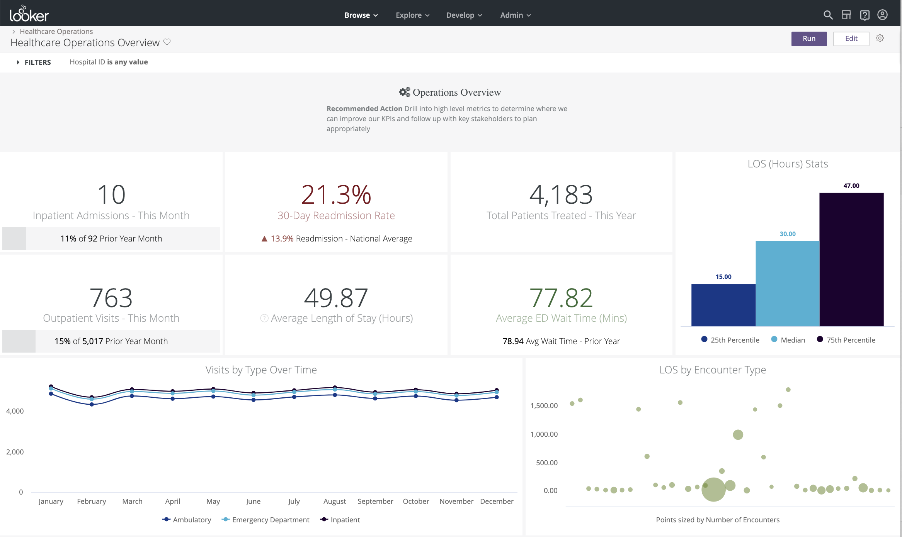
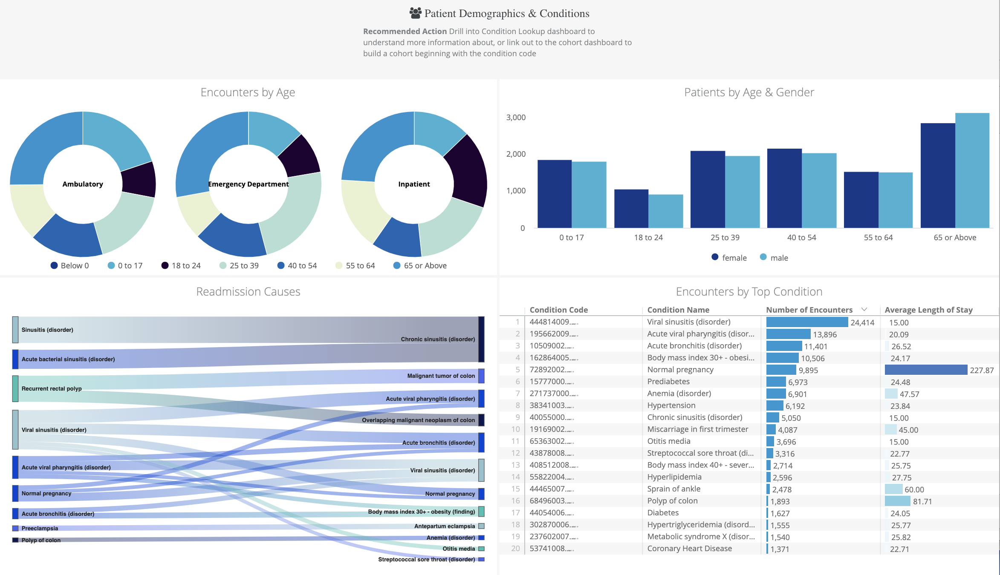
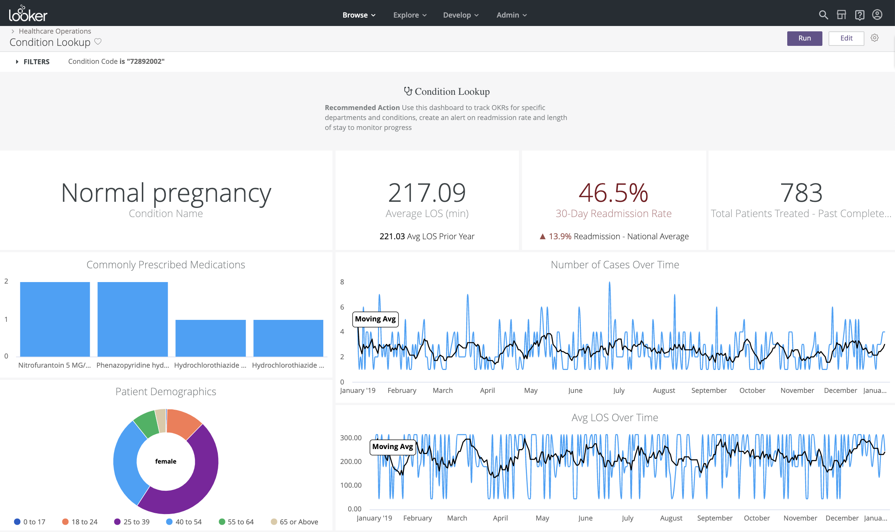

# Healthcare Demo

This repository contains the BigQuery based LookML, for both the model and dashboards, for demonstrating Looker’s ability to provide value within the healthcare landscape.

## How to Use
If you are a Looker partner, please reach out to your analyst for access to dummy data

#### Standard Users
**Option 1) Cloning from this repository:**
Do this if you want to stay up-to-date on changes to the model and do not plan on customizing for your own needs. See steps [here](https://docs.looker.com/data-modeling/getting-started/create-projects#clone_repo).

#### Advanced Users
**Option 2) Project import (preferred):**
Do this if you want to extend the model and make changes within your Looker instance. Existing LookML will still be available to view. Follow these steps [here](https://docs.looker.com/data-modeling/learning-lookml/importing-projects).

**Option 3) Duplicating this repository:**
Do this if you want to make your own copy of the model to directly modify within your Looker instance. Follow these steps, or download the files [here](https://www.nomachetejuggling.com/2011/09/12/moving-one-git-repo-into-another-as-subdirectory/) and upload into your own github repository within the UI.

## Description

This demo uses the FHIR data model, a standard for EHR API data formats. You can find details on the schema and descriptions of the fields [here](http://hl7.org/fhir/). The data itself is publicly available in BigQuery under the *hcls-testing-data:fhir_1m_patients_analytics*. We have modified the data to appear realtime - with updates each night in most tables.

The LookML model is divided into a few folders:

  **1) Unnested Views:** this folder contains all of the views for the original, unstructured, data. Unnesting is done in the LookML using BigQuery's UNNEST and JSON parsing capabilities.

  **2) Simplified Views:** this folder contains all of the views for the flattened database views. The original unstructured tables were unnested at the database for simplicity.

  **3) Realtime Views:** this folder contains views that are specifically being updated every few seconds to demonstrate Looker's ability to handle realtime use cases.

**Dashboards:**

Operations Overview:

Condition Lookup:

